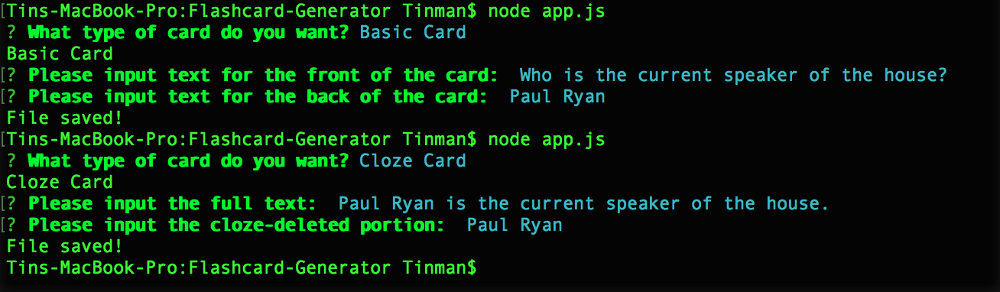

# Flashcard Generator

Flashcard generator is a simple command line application that will allow you to create and log two different type of flashcards. 

The basic card will let you input value for the front and the back of the card. 
> i.e. A card front can say *"Who is the current speaker of the house?"* and the back can be *"Paul Ryan"*.

The cloze card will let you input the full text and the cloze-deleted portion. A cloze card will be created with the partial text in the front that missing the cloze-deleted portion and the full text at the back. 
> i.e. A card front can say *"Paul Ryan is the current speaker of the house."* and the back can be *"... is the current speaker of the house."* with *"Paul Ryan"* being the cloze-deleted portion.

